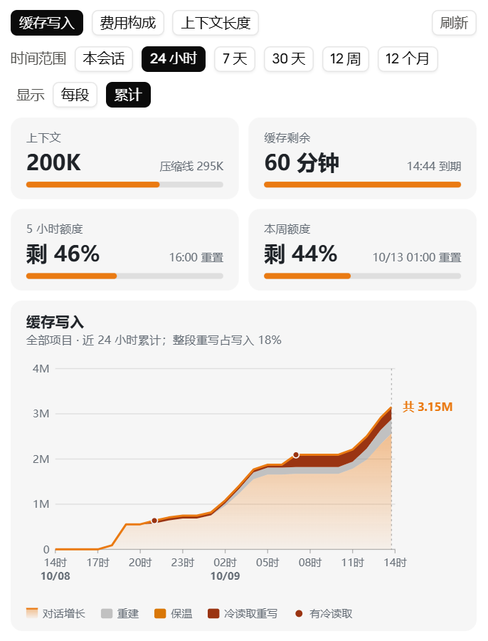
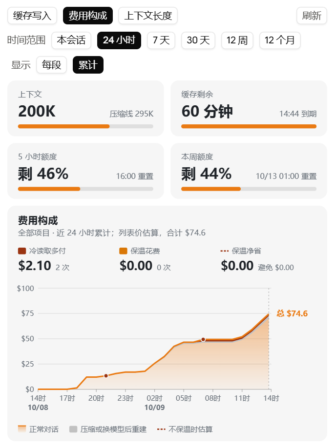
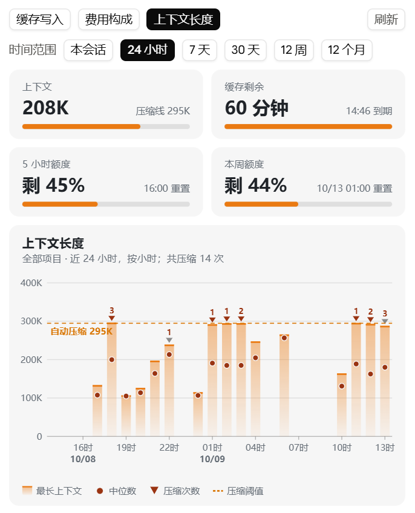

# keepwarm：Claude Code 提示缓存保温插件

中文 | [English](README.en.md)

Claude Code 的提示缓存闲置约 1 小时后过期，下一次请求要把整段上下文重新写入缓存，长会话一次就可能多花几美元（或多耗一截订阅额度）。这个插件在输入框上方显示缓存闲置时间，提供一键保温和定时接续保温，并用图表面板展示上下文、缓存、额度与费用构成。

| 缓存写入（近 24 小时累计） | 费用构成（近 24 小时累计） | 上下文长度（近 24 小时，按小时） |
|:--:|:--:|:--:|
|  |  |  |

## 功能

- **闲置提示**：输入框上方显示“缓存已闲置 N 分钟，约 M 分钟后过期”，附“保温一次”“图表”按钮。
- **保温命令**
  - `/keepwarm`：立即发一次保温请求（一句极短的固定提示，让缓存续期）。
  - `/keepwarm 8`：接续保温 8 小时，闲置满 50 分钟自动发一次；你一发言，时限从那一刻重新起算。上限 24 小时。
  - `/keepwarm off`：停止接续保温。
  - `/keepwarm chart`：打开图表面板。
- **图表面板**
  - 顶部四格：当前上下文、缓存剩余时间、5 小时额度、本周额度。
  - 三张图：缓存时间线（长期范围下为缓存写入）、费用构成、上下文长度。
  - 时间范围：本会话、24 小时、7 天、30 天、12 周、12 个月；长期范围统计全部项目。
  - 费用与缓存写入可切换“每段 / 累计”：24 小时和 7 天默认累计曲线，更长范围默认柱状图。

## 安装

### 方式一：插件市场（推荐）

在终端执行下面两条命令，然后新开一个 Claude Code 会话：

```bash
claude plugin marketplace add https://github.com/Ancean/claude-keepwarm.git
claude plugin install keepwarm@ancean-plugins
```

在会话里也可以用 `/plugin marketplace add Ancean/claude-keepwarm` 和 `/plugin install keepwarm@ancean-plugins`；若提示读不到仓库（简写走 SSH），改用上面的 HTTPS 地址。更新：`claude plugin marketplace update ancean-plugins`，再 `claude plugin update keepwarm@ancean-plugins`。

### 方式二：手动放入技能目录

1. 把本仓库放到 `~/.claude/skills/keepwarm/`（Windows 为 `C:\Users\<用户名>\.claude\skills\keepwarm\`）：

   ```bash
   git clone https://github.com/Ancean/claude-keepwarm.git ~/.claude/skills/keepwarm
   ```

   确认路径是 `~/.claude/skills/keepwarm/.claude-plugin/plugin.json`，不要多套一层文件夹。

2. 重启 Claude 桌面应用或新开一个 Claude Code 会话，插件会以 `keepwarm@skills-dir` 自动加载。
3. 更新：在该目录下 `git pull`，然后新开会话。

两种方式只能选一种，否则会出现重名，后装的那份不加载。

## 运行要求

- 支持函数钩子插件（`hooks.json` 中的 `modules`）的 Claude Code 版本。
- 命令行可直接运行 `python`（3.8 及以上，只用标准库）。没有 Python 时保温功能照常可用，图表面板会提示读取失败。

## 隐私与数据

- 只读取本机会话记录（`~/.claude/projects/`）中的用量数字、时间戳、模型名和压缩元数据，**不读取对话内容**，也不联网上传任何数据。
- 长期汇总会把上述用量数字逐文件缓存到 `~/.claude/keepwarm-cache/rows.json`，删除后会自动重建。
- 保温请求的时刻存在插件自己的存储里，只保留最近 30 个会话。

## 口径说明

- 费用按 Anthropic 列表价估算（Opus、Sonnet、Haiku 三档写在代码 `priceOf` 中），**不是账单**；订阅用户可把金额理解为额度消耗的相对大小。
- “冷读取”指闲置 1 小时以上后整段重写缓存的请求，多付金额按“缓存写入价 − 缓存读取价”估算；压缩后或换模型后的整段重写单列为“重建”，保温无法避免。
- “保温净省”= 保温避免的冷读取费用 − 保温请求本身的花费，只在保温后确实接上了真实对话时计入。
- 自动压缩阈值从 Claude Code 读取，读不到时使用后备值 295K。

## 已知限制

- 电脑休眠或关闭 Claude 窗口期间不会发送保温请求。
- Claude Code 每日是否另有清理缓存的时刻尚未核实，因此接续保温硬上限为 24 小时。
- 更早会话中的保温请求若已超出最近 30 个会话的记录，会被计为普通请求。
